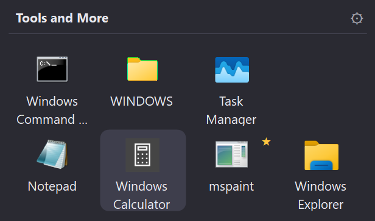
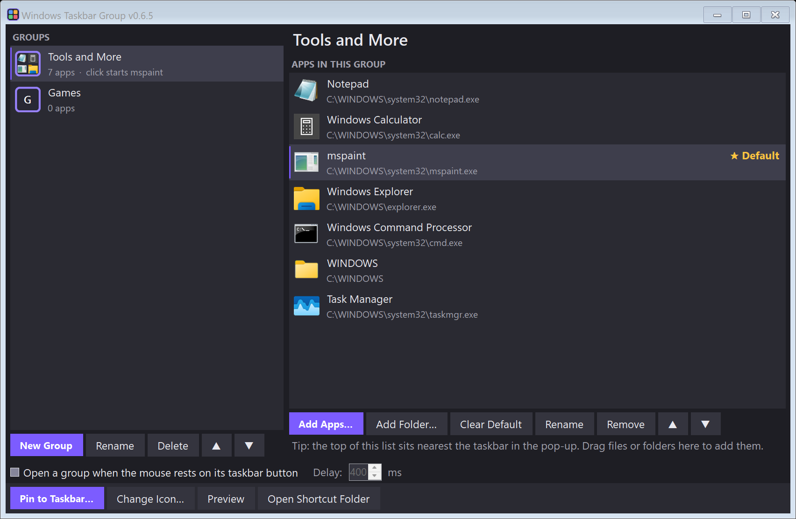
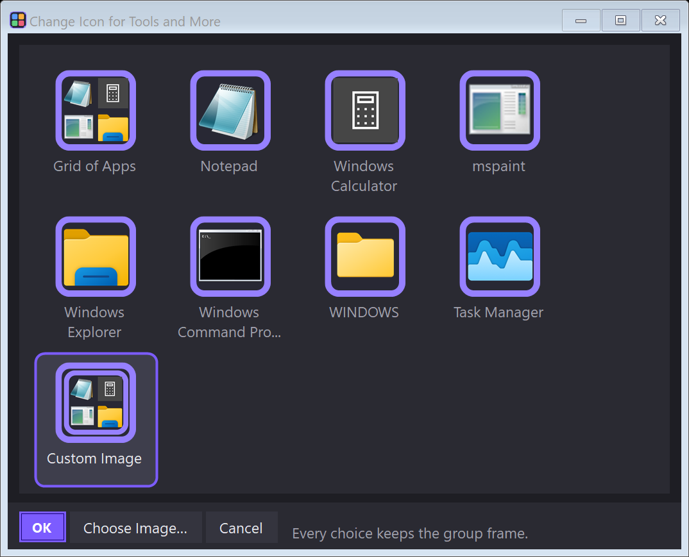

# Windows Taskbar Group

Put several apps behind one taskbar button. Each group is pinned like an app. Hover over it, or click it, and a small pop-up shows the group's apps right above the taskbar.



Windows 11 has no built-in way to put folders or groups on the taskbar. This tool pins one shortcut per group and draws the pop-up itself.

## Features

- **Groups of anything:** apps, shortcuts, Store apps, documents and folders.
- **Hover to open:** rest the mouse on a pinned group and its pop-up opens (optional, with an adjustable delay). A small helper runs in the tray for this and starts when you sign in.
- **Click to open:** without hover, a click opens the pop-up. You can also give a group a **default app**: a click then starts that app straight away, and hover (or Shift+click) still shows all of them.
- **Your most used apps nearest the mouse:** the top of a group's list sits on the row next to the taskbar.
- **Add apps quickly:** pick from the apps that are **running now** or the ones **pinned to your taskbar**. Pinned apps can be **unpinned** in the same step, so your taskbar gets tidier as you group things. You can also browse for files, or drag them onto the list.
- **Group icons:** a grid of the group's first four apps, one app's icon, or your own picture. Each sits in the same framed tile, so groups are easy to tell apart from ordinary apps. The pinned button updates when you change it.
- **Every group is its own taskbar button**, on every monitor's taskbar.
- **Portable:** your groups are stored in a `data` folder next to the exe. There's no installer and no registry.



## Requirements

- Windows 11 (built and tested there; Windows 10 is untested).
- The [.NET 8 Desktop Runtime](https://dotnet.microsoft.com/download/dotnet/8.0) (x64). Windows offers to download it the first time if it's missing.

## Install

1. Download `Windows-Taskbar-Group-<version>.zip` from [Releases](https://github.com/leeper48/Taskbar-Groups/releases).
2. Unzip it into a folder of your own, for example `C:\Tools\Taskbar Group`. **Not** `Program Files`: the app keeps your groups in a `data` folder next to itself and needs to write there.
3. Run `TaskbarGroup.exe`.

To update, replace `TaskbarGroup.exe` and keep the `data` folder.

### Why Windows may warn you

The exe isn't code-signed, so Windows SmartScreen may say it "protected your PC". Click **More info**, then **Run anyway**. Download only from this repository's Releases page. To check that the file is the one published here, compare its checksum with the `.sha256` file next to the zip:

```powershell
Get-FileHash .\Windows-Taskbar-Group-0.6.5.zip -Algorithm SHA256
```

## How to use it

1. **New Group**, give it a name.
2. **Add Apps…**: tick apps under **Running Apps** or **On the Taskbar** (optionally unpinning them), or use **Browse Files…**.
3. Arrange them with ▲ ▼. The top of the list sits nearest the taskbar in the pop-up.
4. **Pin to Taskbar…**: the group's shortcut is selected in Explorer. Right-click it, **Show more options**, **Pin to taskbar**. (Windows doesn't let apps pin themselves.)
5. Optional:
   - **Change Icon…** to choose the group's picture.
   - **Set as Default** on an app, so a click on the group starts it.
   - Tick **Open a group when the mouse rests on its taskbar button** to open groups on hover.



In the pop-up: click an app, or use the arrow keys and Enter, or press 1–9. Esc or a click elsewhere closes it. The ⚙ opens the group in settings.

## Privacy

The app doesn't connect to the internet. It reads your taskbar's pinned shortcuts and open windows only to offer them in Add Apps, and keeps everything in its own `data` folder.

## Build from source

.NET 8 SDK on Windows:

```bat
TaskbarGroup\build.bat
```

This publishes to `TaskbarGroup\publish\`. `TaskbarGroup.exe --selftest <empty folder>` runs the self-test (shortcuts, icons, hover detection on your real taskbar, read-only) and writes a report plus screenshots there.

## License

[MIT](LICENSE)
